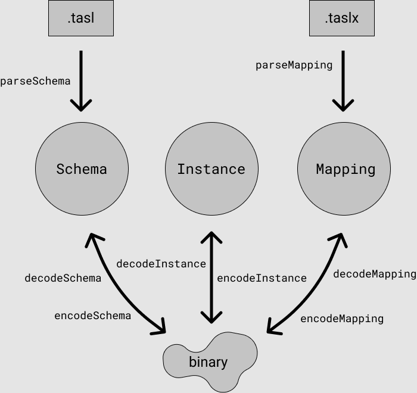

# Documentation

There are three primary data structures in tasl, represented in this JavaScript library as classes exported at the top level.

```ts
import { Schema, Instance, Mapping } from "tasl"
```

- A `Schema` is a runtime representation of a dataset schema.
- An `Instance` is a runtime representation of the contents of a dataset with a particular schema.
- A `Mapping` is a runtime representation of a transformation between two particular schemas.

Each of these can be instantiated directly with a JSON format, encoded to a `Uint8Array`, and decoded from a `Uint8Array`. Additionally, tasl has two DSLs `.tasl` and `.taslx` for writing schemas and mappings (respectively) as human-readable source files.



Each of these are documented in depth on their own page:

- [schemas.md](./schemas.md)
- [instances.md](./instances.md)
- [mappings.md](./mappings.md)

It's best to read these in order: schemas, then instances, and then mappings.

A consolidated TypeScript API declaration is given in [API.md](./API.md) as well.
