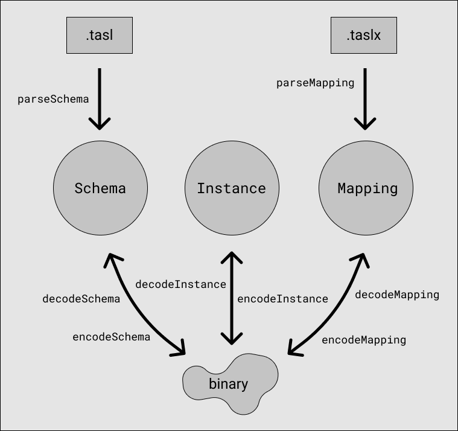

# Documentation

There are three primary data structures in tasl, represented in this JavaScript library as classes exported at the top level.

```ts
import { Schema, Instance, Mapping } from "tasl"
```

- A `Schema` is a runtime representation of a dataset schema.
- An `Instance` is a runtime representation of the contents of a dataset with a particular schema.
- A `Mapping` is a runtime representation of a transformation between two particular schemas.

Each of these can be instantiated directly with a JSON format, encoded to a `Uint8Array`, and decoded from a `Uint8Array`. Additionally, tasl has two DSLs `.tasl` and `.taslx` for writing schemas and mappings (respectively) as human-readable source files.



Each of these are documented in depth on their own page:

- [schemas.md](./schemas.md)
- [instances.md](./instances.md)
- [mappings.md](./mappings.md)

It's best to read these in order: schemas, then instances, and then mappings.

```ts
declare class Schema {
	constructor(readonly classes: Record<string, types.Type>)
	get(key: string): types.Type
	has(key: string): boolean
	keys(): Iterable<string>
	values(): Iterable<types.Type>
	entries(): Iterable<[string, types.Type]>
	isEqualTo(schema: Schema): boolean
}

declare function encodeSchema(schema: Schema): Uint8Array
declare function decodeSchema(data: Uint8Array): Schema
declare function parseSchema(input: string): Schema

declare namespace types {
	type Type = URI | Literal | Product | Coproduct | Reference

	type URI = { kind: "uri" }
	type Literal = { kind: "literal"; datatype: string }
	type Product = { kind: "product"; components: Record<string, Type> }
	type Coproduct = { kind: "coproduct"; options: Record<string, Type> }
	type Reference = { kind: "reference"; key: string }

	function uri(): URI
	function literal(datatype: string): Literal
	function product(components: Record<string, Type>): Product
	function coproduct(options: Record<string, Type>): Coproduct
	function reference(key: string): Reference

	const unit: Product
	const string: Literal
	const boolean: Literal
	const f32: Literal
	const f64: Literal
	const i64: Literal
	const i32: Literal
	const i16: Literal
	const i8: Literal
	const u64: Literal
	const u32: Literal
	const u16: Literal
	const u8: Literal
	const bytes: Literal
	const JSON: Literal

	function isSubtypeOf(x: Type, y: Type): boolean
	function isEqualTo(x: Type, y: Type): boolean
	function hasCommonBounds(x: Type, y: Type): boolean
	function greatestCommonSubtype(x: Type, y: Type): Type
	function leastCommonSupertype(x: Type, y: Type): Type
}
```

```ts
declare class Instance {
	constructor(
		readonly schema: Schema,
		readonly elements: Record<string, values.Value[]>
	)
	count(key: string): number
	get(key: string, index: number): values.Value
	keys(key: string): Iterable<number>
	values(key: string): Iterable<values.Value>
	entries(key: string): Iterable<[number, values.Value]>
	isEqualTo(instance: Instance): boolean
}

declare function encodeInstance(instance: Instance): Uint8Array
declare function decodeInstance(schema: Schema, data: Uint8Array): Instance

declare namespace values {
	type Value = URI | Literal | Product | Coproduct | Reference

	type URI = { kind: "uri"; value: string }
	type Literal = { kind: "literal"; value: string }
	type Product = { kind: "product"; components: Record<string, Value> }
	type Coproduct = { kind: "coproduct"; key: string; value: Value }
	type Reference = { kind: "reference"; index: number }

	function uri(value: string): URI
	function literal(value: string): Literal
	function product(components: Record<string, Value>): Product
	function coproduct(key: string, value: Value): Coproduct
	function reference(index: number): Reference

	function unit(): Product
	function string(value: string): Literal
	function boolean(value: boolean): Literal
	function f32(value: number): Literal
	function f64(value: number): Literal
	function i64(value: bigint): Literal
	function i32(value: number): Literal
	function i16(value: number): Literal
	function i8(value: number): Literal
	function u64(value: bigint): Literal
	function u32(value: number): Literal
	function u16(value: number): Literal
	function u8(value: number): Literal
	function bytes(value: Uint8Array): Literal
	function JSON(value: any): Literal

	function isEqualTo(type: types.Type, x: Value, y: Value): boolean
	function cast(type: types.Type, value: Value, target: types.Type): Value
}
```

```ts
declare class Mapping {
	constructor(
		readonly source: Schema,
		readonly target: Schema,
		readonly maps: Record<string, expressions.Map>
	)
	get(key: string): expressions.Map
	has(key: string): boolean
	keys(): Iterable<string>
	values(): Iterable<expressions.Map>
	entries(): Iterable<[string, expressions.Map]>
	apply(instance: Instance): Instance
}

declare function encodeMapping(mapping: Mapping): Uint8Array
declare function decodeMapping(
	source: Schema,
	target: Schema,
	data: Uint8Array
): Mapping
declare function parseMapping(
	source: Schema,
	target: Schema,
	input: string
): Mapping

declare namespace expressions {
	type Map = { key: string; id: string; value: Expression }

	type Expression = URI | Literal | Product | Coproduct | Term | Match

	type URI = { kind: "uri"; value: string }
	type Literal = { kind: "literal"; value: string }
	type Product = { kind: "product"; components: Record<string, Expression> }
	type Coproduct = { kind: "coproduct"; key: string; value: Expression }

	type Term = Variable | Projection | Dereference
	type Variable = { kind: "variable"; id: string }
	type Projection = { kind: "projection"; key: string; value: Term }
	type Dereference = { kind: "dereference"; key: string; value: Term }

	type Match = { kind: "match"; value: Term; cases: Record<string, Case> }
	type Case = { id: string; value: Expression }

	function uri(value: string): URI
	function literal(value: string): Literal
	function product(components: Record<string, Expression>): Product
	function coproduct(key: string, value: Expression): Coproduct
	function variable(id: string): Variable
	function projection(key: string, value: Term): Projection
	function dereference(key: string, value: Term): Dereference
	function match(value: Term, cases: Record<string, Case>): Match
}
```
